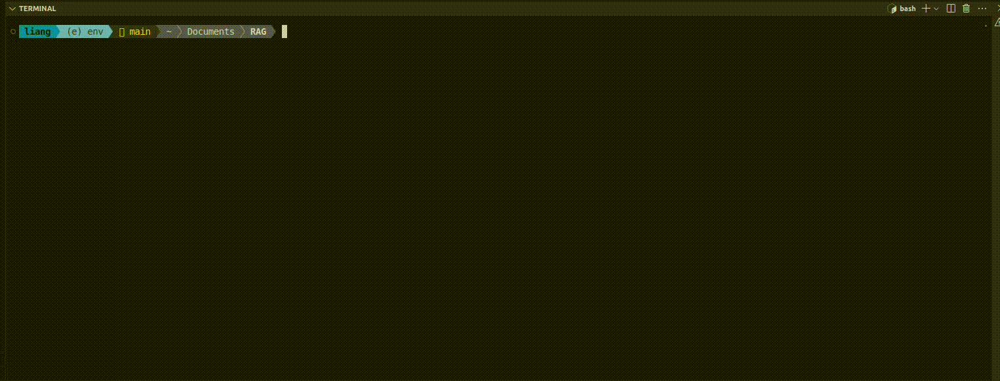
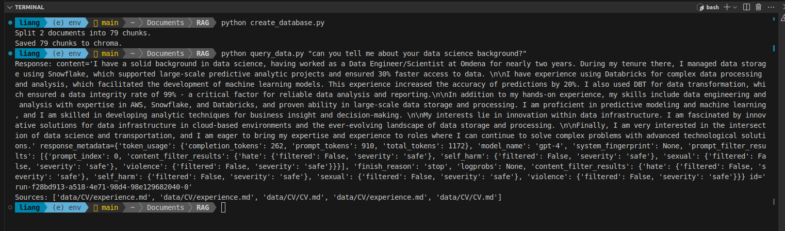

# Talk to my CV

A simple MVP to talk to my CV

# Here is a short demo




# Instruction
Install dependencies.

```python
pip install -r requirements.txt
```

Create the Chroma DB.

```python
python create_database.py
```

Query the Chroma DB.

```python
python query_data.py "Can you tell me about your data science background?"
```